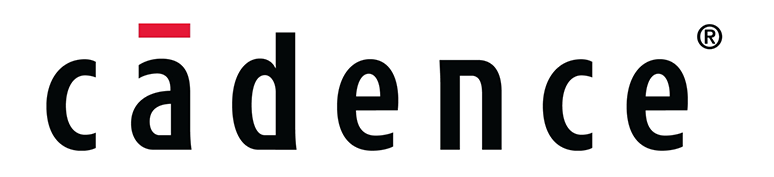
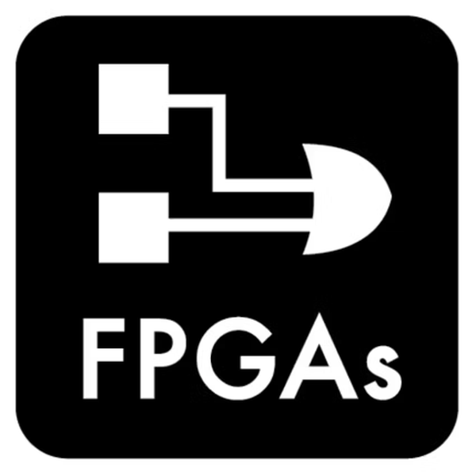
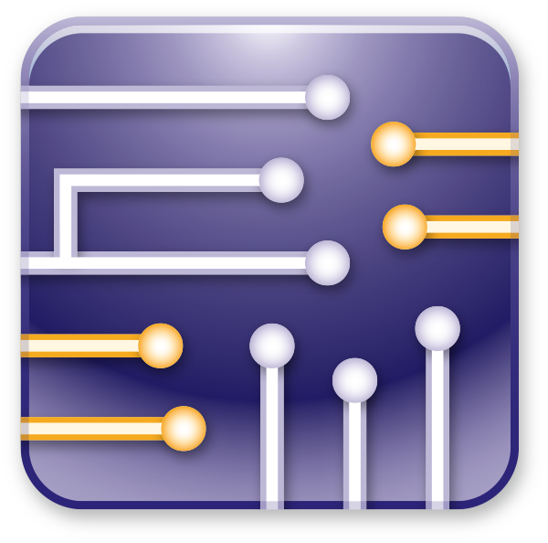

  

<table><th><h2 align="center">ABOUTME</h2></th>
<tr><td>
  <h4>Hi , I'm Ahmed Adel. I'm interested about Digital IC Design and Verification🤖! I'm currently doing my bachelor degree🎓 in Electronics and Electrical Communication Engineering at Faculty of Engineering, Cairo University🏫.</h4>

> 🌱 I’m currently learning **Digital Design and Digital Verification**

> 👥 I’m looking to collaborate on **more Digital Design and Verification Projects** 🔭

> 📫 How to reach me ahmed.adel5588000@gmail.com

<h3 align="left">🌐 Contact me through :</h3>

<code></code>
<code></code>

<h3 align="left">💻 Languages:</h3>
‍
<code></code>
<code></code>
<code></code>
<code></code>
<code></code>

<h3 align="left">🔨 Tools :

<code></code>
<code></code>
<code></code>
<code></code>
<code></code>
<code></code>
<code></code>
<code></code>

  </td>
  </tr>
  <tr>
    <td>
      
      <h4 align="right">View Count</h4>
     
    </td>
  </tr>
  <table>     

